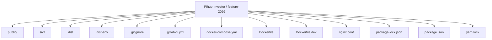
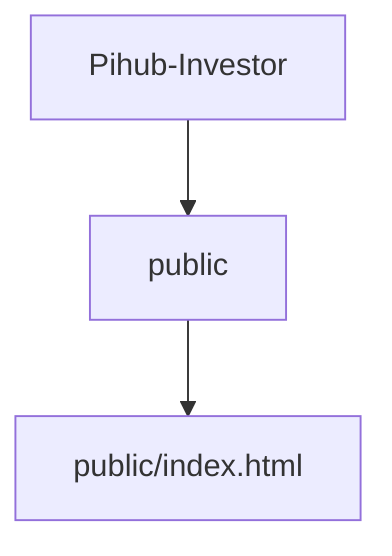
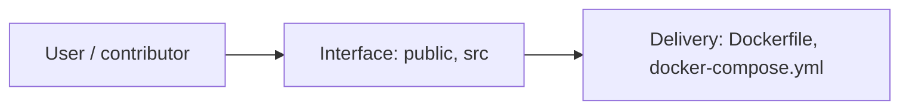
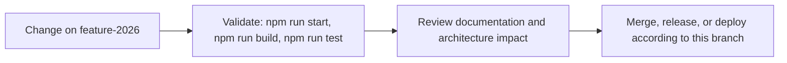

# Frontend: CreditTech

<!-- interactive-readme-standard:start -->

> [!NOTE]
> **Branch-specific documentation:** this section is maintained for [`feature-2026`](https://github.com/Nischhalsubba/Pihub-Investor/tree/feature-2026). It is generated from the files present on this branch and preserves the project-authored README below.

<details open>
<summary><strong>Interactive repository guide</strong></summary>

## Branch overview

| Item | Value |
|---|---|
| Repository | [`Nischhalsubba/Pihub-Investor`](https://github.com/Nischhalsubba/Pihub-Investor) |
| Branch | [`feature-2026`](https://github.com/Nischhalsubba/Pihub-Investor/tree/feature-2026) |
| Detected stack | React, Docker, Docker Compose, JavaScript, Sass, CSS, HTML |
| Detected manifests | package.json, Dockerfile, docker-compose.yml |
| Documentation policy | Every maintained branch must explain purpose, setup, structure, architecture, flows, testing, delivery, security, and ownership. |

## Repository structure



The diagram is generated from the branch's actual top-level files and directories. Use the branch link above for complete source navigation.

## Website or application structure



## Application and responsibility flow



## Change-to-delivery flow



## README requirements for this branch

- Explain what this branch contains and how it differs from the default branch.
- Keep installation, configuration, usage, testing, deployment, security, support, and license information accurate.
- Document repository, website or application, API, data, authentication, background-job, and deployment flows when they exist.
- Prefer Mermaid diagrams and expandable `<details>` sections for visual navigation.
- Link diagrams and modules to real source paths; never invent missing components.
- Preserve project-specific documentation and update diagrams whenever architecture or major paths change.
- Treat secrets, private infrastructure, customer data, and credentials as prohibited README content.

</details>

<!-- interactive-readme-standard:end -->

### Configuration
Please create a `.env` file if it doesn't exist. A sample environment file is `.dist-env`.

- .env: Default.
- .env.local: Local overrides. This file is loaded for all environments except test.
- .env.development, .env.test, .env.production: Environment-specific settings.
- .env.development.local, .env.test.local, .env.production.local: Local overrides of environment-specific settings.

Files on the left have more priority than files on the right:

- npm start: .env.development.local, .env.development, .env.local, .env
- npm run build: .env.production.local, .env.production, .env.local, .env
- npm test: .env.test.local, .env.test, .env (note .env.local is missing)

These variables will act as the defaults if the machine does not explicitly set them.
Please refer to the [adding-custom-environment-variables](https://create-react-app.dev/docs/adding-custom-environment-variables#what-other-env-files-can-be-used) and 
[dotenv documentation](https://github.com/motdotla/dotenv) for more details.

The app uses React.

### Demo Mode (No Backend Required)
If you do not have the API running, you can use the built-in demo data.

- Set `REACT_APP_DEMO=true` in your `.env`.
- Optional: Set `REACT_APP_DEMO_DELAY_MS=150` to simulate network latency.
- When `REACT_APP_DEMO=true`, the app uses local mock data for API calls and provides a demo login token.
- In demo mode you can use any email/password to sign in.

### Using npm (Development)

```
> npm install
> npm start
> npm run test
```

#### For Production Build

```
 > npm run build
```

### GitHub Pages
This repo is configured to build with relative asset paths (`"homepage": "."`) and uses `HashRouter` for client-side routing.

1. Run `npm install` (once).
2. Run `npm run deploy` (this builds and publishes `build/` to the `gh-pages` branch).
3. In GitHub, enable Pages to use the `gh-pages` branch.
4. If you want to use a different base path, update the `homepage` field in `package.json` before building.

### Docker Container

#### For Development

```
> docker build -f Dockerfile.dev .
> docker container run  -p 3000:3000 <dockerid>
```

#### For Production

```
> docker build . -t <tagname>
> docker run -p 8080:80 <tagname>
```

#### Docker Compose

```
> docker-compose up
```

## Developers Guide

### Adding Custom Environment Variables
Your project can consume variables declared in your environment as if they were declared locally in your JS files. By default you will have `NODE_ENV` defined for you, and any other environment variables starting with `REACT_APP_`.
For more info checkout [adding custom environment variables](https://create-react-app.dev/docs/adding-custom-environment-variables)

## Authors

- **Bhusan Thapa** - _Initial work_
- **Anuj Shakya** - _Intital work_
