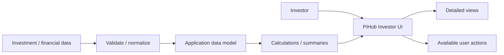
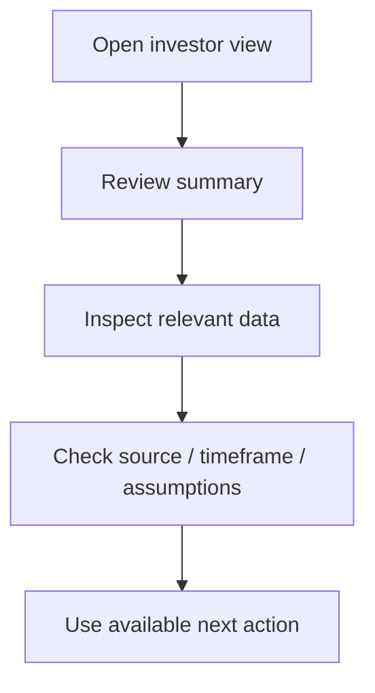
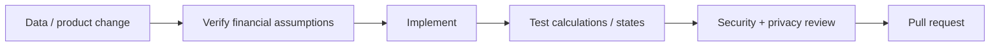

<div align="center">

# PiHub Investor

**An investor-facing product repository for presenting financial or investment information, portfolio context, data views, and decision-support workflows in a clear interface.**


[Browse develop branch](https://github.com/Nischhalsubba/Pihub-Investor/tree/develop) · [Issues](https://github.com/Nischhalsubba/Pihub-Investor/issues)

</div>

## Overview

**PiHub Investor** is documented as an investor-oriented interface. The product should make financial information understandable, show where data comes from, and distinguish facts, calculations, historical information, and assumptions rather than blending them into one suspiciously confident dashboard.

| Audience | Focus |
|---|---|
| Investors / users | Understand portfolio or investment information |
| Developers | Data ingestion, calculations, state and security |
| Designers | Dense financial data, hierarchy, responsive tables/charts and states |
| Product / finance reviewers | Terminology, calculations, disclaimers and source accuracy |

<details open>
<summary><strong>🏗️ Interactive investor architecture</strong></summary>



</details>

## User flow



## Getting started

```bash
git clone https://github.com/Nischhalsubba/Pihub-Investor.git
cd Pihub-Investor
git checkout develop
```

Use the manifests and lockfiles on `develop` to determine the current runtime and commands.

## Product, security & accessibility

Financial interfaces should expose data freshness, units, timeframes and calculation assumptions. Protect private investment information, avoid leaking credentials, preserve keyboard/focus behavior, provide non-color-only chart distinctions, and use accessible table or text alternatives for important visualizations.

## SEO & discoverability

Public marketing pages may use accurate terms such as **investor platform, investment dashboard, portfolio analytics, financial data, investment insights, and portfolio tracking** only where supported by implemented scope. Authenticated/private financial screens should not be indexed merely to satisfy an SEO checklist.

## Contribution flow


