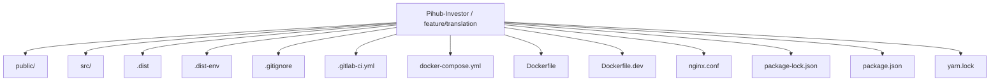
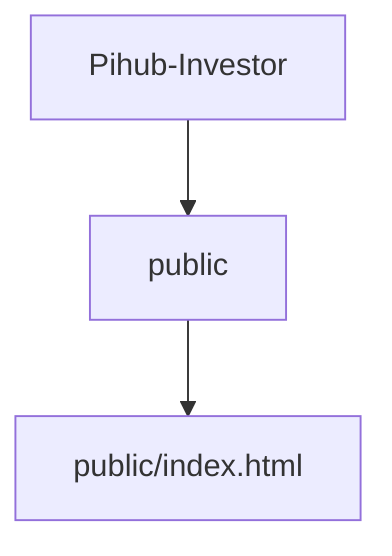
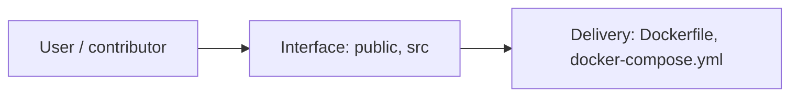
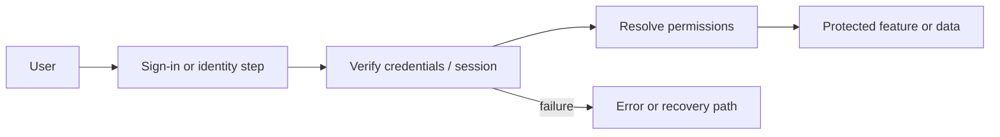
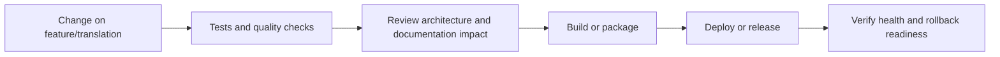
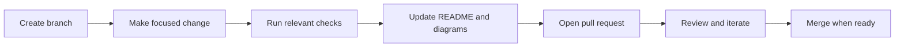

<!-- interactive-readme-standard:start -->

<div align="center">

# Pihub-Investor

**Branch-aware technical guide for [`feature/translation`](https://github.com/Nischhalsubba/Pihub-Investor/tree/feature/translation)**

<p>       </p>

<p>
  <a href="https://github.com/Nischhalsubba/Pihub-Investor/tree/feature/translation"><strong>Browse source</strong></a> ·
  <a href="https://github.com/Nischhalsubba/Pihub-Investor/issues"><strong>Issues</strong></a> ·
  <a href="https://github.com/Nischhalsubba/Pihub-Investor/codespaces/new?ref=feature%2Ftranslation"><strong>Open in Codespaces</strong></a>
</p>

</div>

> [!IMPORTANT]
> This guide is generated from the files actually present on `feature/translation`. It links to detected source paths, preserves project-authored notes, and avoids claiming components that were not found.

## At a glance

| Item | Detected value |
|---|---|
| Purpose | A web or interface project documented from the files currently present on this branch. |
| Branch role | Compared with `develop` |
| Stack | React, Docker, Docker Compose, JavaScript, CSS, HTML |
| Manifests | package.json, Dockerfile, docker-compose.yml |
| Prerequisites | Node.js, Yarn |
| Delivery | Dockerfile, docker-compose.yml |
| License | No license file detected |

## Branch scope

This branch differs from the default branch in the following detected paths:

- [`README.md`](https://github.com/Nischhalsubba/Pihub-Investor/blob/feature/translation/README.md)

## Quick start

```bash
yarn install
yarn start
yarn build
yarn test
```

### Configuration surface

- No committed environment example file was detected.

> Never commit secrets, private keys, production credentials, customer data, or unredacted infrastructure details.

## Repository map



| Responsibility | Detected source paths |
|---|---|
| Interface | [`public`](https://github.com/Nischhalsubba/Pihub-Investor/tree/feature/translation/public), [`src`](https://github.com/Nischhalsubba/Pihub-Investor/tree/feature/translation/src) |

## Website or application map



## Architecture and responsibility flow



<details>
<summary><strong>Authentication and authorization flow</strong></summary>



Relevant detected files: [`src/reducers/auth.js`](https://github.com/Nischhalsubba/Pihub-Investor/blob/feature/translation/src/reducers/auth.js), [`src/actions/login.js`](https://github.com/Nischhalsubba/Pihub-Investor/blob/feature/translation/src/actions/login.js), [`src/components/_auth/RequireInvestorAuth.js`](https://github.com/Nischhalsubba/Pihub-Investor/blob/feature/translation/src/components/_auth/RequireInvestorAuth.js), [`src/components/_auth/RequireVerfication.js`](https://github.com/Nischhalsubba/Pihub-Investor/blob/feature/translation/src/components/_auth/RequireVerfication.js), [`src/components/_auth/RequireNoAuth.js`](https://github.com/Nischhalsubba/Pihub-Investor/blob/feature/translation/src/components/_auth/RequireNoAuth.js), [`src/components/user/Login.js`](https://github.com/Nischhalsubba/Pihub-Investor/blob/feature/translation/src/components/user/Login.js).

> The diagram expresses the responsibility sequence only. Confirm exact providers, token formats, roles, and recovery behavior in the linked source.

</details>

## Quality, security, and operations

<table>
<tr>
<td width="33%" valign="top">

### Quality

- No conventional test directory was detected automatically.

Detected commands:
- `yarn start`
- `yarn build`
- `yarn test`

</td>
<td width="33%" valign="top">

### Security

- No dedicated security policy or automated dependency configuration was detected.

Review authentication, authorization, input validation, dependency updates, secret handling, and failure recovery before release.

</td>
<td width="34%" valign="top">

### Observability

- No dedicated observability integration was detected automatically.

Define useful logs, metrics, traces, alerts, and rollback signals for production-facing branches.

</td>
</tr>
</table>

## Delivery flow



### Automation detected

- No GitHub Actions workflow files were detected.

## Contribution flow



- Keep changes focused and explain architectural consequences.
- Run the checks relevant to the changed area.
- Update diagrams whenever routes, modules, data models, authentication, jobs, or delivery paths change.
- Add screenshots or recordings for visual behavior changes when useful.
- Use issues for reproducible defects and pull requests for reviewable changes.

## Ownership and support

| Topic | Source |
|---|---|
| Repository | [`Nischhalsubba/Pihub-Investor`](https://github.com/Nischhalsubba/Pihub-Investor) |
| Branch | [`feature/translation`](https://github.com/Nischhalsubba/Pihub-Investor/tree/feature/translation) |
| Ownership | No CODEOWNERS file detected |
| Contributing | Use the contribution flow above |
| Support | [Open or review issues](https://github.com/Nischhalsubba/Pihub-Investor/issues) |
| License | No license file detected |

<details>
<summary><strong>Documentation maintenance checklist</strong></summary>

- [ ] Purpose and branch scope are accurate.
- [ ] Setup and configuration commands still work.
- [ ] Repository, application, API, data, authentication, job, and deployment diagrams match the code.
- [ ] Tests, security controls, observability, and rollback behavior are documented.
- [ ] Links point to real files on this branch.
- [ ] No secrets or private operational details are exposed.

</details>

<!-- interactive-readme-standard:end -->

<!-- project-authored-notes:start -->
<details>
<summary><strong>Project-authored notes preserved from this branch</strong></summary>

# Frontend: CreditTech

### Configuration
Please create .env* file  if it already doesn't exist. A sample environment file is ``.dist-env``

- .env: Default.
- .env.local: Local overrides. This file is loaded for all environments except test.
- .env.development, .env.test, .env.production: Environment-specific settings.
- .env.development.local, .env.test.local, .env.production.local: Local overrides of environment-specific settings.

Files on the left have more priority than files on the right:

- npm start: .env.development.local, .env.development, .env.local, .env
- npm run build: .env.production.local, .env.production, .env.local, .env
- npm test: .env.test.local, .env.test, .env (note .env.local is missing)

These variables will act as the defaults if the machine does not explicitly set them.
Please refer to the [adding-custom-environment-variables](https://create-react-app.dev/docs/adding-custom-environment-variables#what-other-env-files-can-be-used) and 
[dotenv documentation](https://github.com/motdotla/dotenv) for more details.

The app uses React.

### Using npm (Development)

```
> npm install
> npm start
> npm run test
```

#### For Production Build

```
 > npm run build
```

### Docker Container

#### For Development

```
> docker build -f Dockerfile.dev .
> docker container run  -p 3000:3000 <dockerid>
```

#### For Production

```
> docker build . -t <tagname>
> docker run -p 8080:80 <tagname>
```

#### Docker Compose

```
> docker-compose up
```

## Developers Guide

### Adding Custom Environment Variables
Your project can consume variables declared in your environment as if they were declared locally in your JS files. By default you will have `NODE_ENV` defined for you, and any other environment variables starting with `REACT_APP_`.
For more info checkout [adding custom environment variables](https://create-react-app.dev/docs/adding-custom-environment-variables)

## Authors

- **Bhusan Thapa** - _Initial work_
- **Anuj Shakya** - _Intital work_

</details>
<!-- project-authored-notes:end -->
