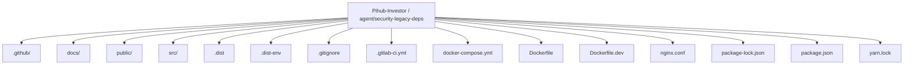
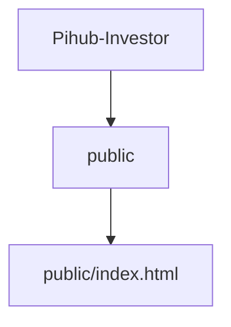
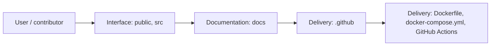
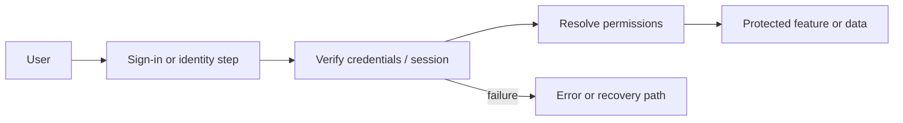
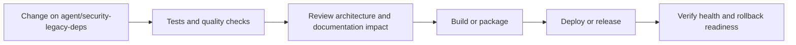
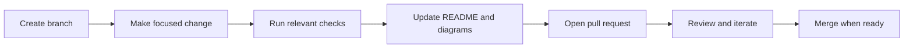

<!-- interactive-readme-standard:start -->

<div align="center">

# Pihub-Investor

**Branch-aware technical guide for [`agent/security-legacy-deps`](https://github.com/Nischhalsubba/Pihub-Investor/tree/agent/security-legacy-deps)**

<p>       </p>

<p>
  <a href="https://github.com/Nischhalsubba/Pihub-Investor/tree/agent/security-legacy-deps"><strong>Browse source</strong></a> ·
  <a href="https://github.com/Nischhalsubba/Pihub-Investor/issues"><strong>Issues</strong></a> ·
  <a href="https://github.com/Nischhalsubba/Pihub-Investor/codespaces/new?ref=agent%2Fsecurity-legacy-deps"><strong>Open in Codespaces</strong></a>
</p>

</div>

> [!IMPORTANT]
> This guide is generated from the files actually present on `agent/security-legacy-deps`. It links to detected source paths, preserves project-authored notes, and avoids claiming components that were not found.

## At a glance

| Item | Detected value |
|---|---|
| Purpose | A legacy Create React App frontend for a Pihub/CreditTech investor platform with authentication, verification gates, product workflows, credit request views, multilingual support, Redux state, and Docker deployment support. |
| Branch role | Compared with `develop` |
| Stack | React, Docker, Docker Compose, JavaScript, Sass, CSS, HTML |
| Manifests | package.json, Dockerfile, docker-compose.yml |
| Prerequisites | Node.js, Yarn |
| Delivery | Dockerfile, docker-compose.yml, GitHub Actions |
| License | No license file detected |

## Branch scope

No branch-specific file differences were detected against the default branch at generation time.


## Quick start

```bash
yarn install
yarn start
yarn build
yarn test
```

### Configuration surface

- No committed environment example file was detected.

> Never commit secrets, private keys, production credentials, customer data, or unredacted infrastructure details.

## Repository map



| Responsibility | Detected source paths |
|---|---|
| Interface | [`public`](https://github.com/Nischhalsubba/Pihub-Investor/tree/agent/security-legacy-deps/public), [`src`](https://github.com/Nischhalsubba/Pihub-Investor/tree/agent/security-legacy-deps/src) |
| Documentation | [`docs`](https://github.com/Nischhalsubba/Pihub-Investor/tree/agent/security-legacy-deps/docs) |
| Delivery | [`.github`](https://github.com/Nischhalsubba/Pihub-Investor/tree/agent/security-legacy-deps/.github) |

## Website or application map



## Architecture and responsibility flow



<details>
<summary><strong>Authentication and authorization flow</strong></summary>



Relevant detected files: [`src/reducers/auth.js`](https://github.com/Nischhalsubba/Pihub-Investor/blob/agent/security-legacy-deps/src/reducers/auth.js), [`src/actions/login.js`](https://github.com/Nischhalsubba/Pihub-Investor/blob/agent/security-legacy-deps/src/actions/login.js), [`src/components/_auth/RequireInvestorAuth.js`](https://github.com/Nischhalsubba/Pihub-Investor/blob/agent/security-legacy-deps/src/components/_auth/RequireInvestorAuth.js), [`src/components/_auth/RequireVerfication.js`](https://github.com/Nischhalsubba/Pihub-Investor/blob/agent/security-legacy-deps/src/components/_auth/RequireVerfication.js), [`src/components/_auth/RequireNoAuth.js`](https://github.com/Nischhalsubba/Pihub-Investor/blob/agent/security-legacy-deps/src/components/_auth/RequireNoAuth.js), [`src/components/user/Login.js`](https://github.com/Nischhalsubba/Pihub-Investor/blob/agent/security-legacy-deps/src/components/user/Login.js).

> The diagram expresses the responsibility sequence only. Confirm exact providers, token formats, roles, and recovery behavior in the linked source.

</details>

## Quality, security, and operations

<table>
<tr>
<td width="33%" valign="top">

### Quality

- No conventional test directory was detected automatically.

Detected commands:
- `yarn start`
- `yarn build`
- `yarn test`

</td>
<td width="33%" valign="top">

### Security

- No dedicated security policy or automated dependency configuration was detected.

Review authentication, authorization, input validation, dependency updates, secret handling, and failure recovery before release.

</td>
<td width="34%" valign="top">

### Observability

- No dedicated observability integration was detected automatically.

Define useful logs, metrics, traces, alerts, and rollback signals for production-facing branches.

</td>
</tr>
</table>

## Delivery flow



### Automation detected

- [`.github/workflows/apply-interactive-readme.yml`](https://github.com/Nischhalsubba/Pihub-Investor/blob/agent/security-legacy-deps/.github/workflows/apply-interactive-readme.yml)

## Contribution flow



- Keep changes focused and explain architectural consequences.
- Run the checks relevant to the changed area.
- Update diagrams whenever routes, modules, data models, authentication, jobs, or delivery paths change.
- Add screenshots or recordings for visual behavior changes when useful.
- Use issues for reproducible defects and pull requests for reviewable changes.

## Ownership and support

| Topic | Source |
|---|---|
| Repository | [`Nischhalsubba/Pihub-Investor`](https://github.com/Nischhalsubba/Pihub-Investor) |
| Branch | [`agent/security-legacy-deps`](https://github.com/Nischhalsubba/Pihub-Investor/tree/agent/security-legacy-deps) |
| Ownership | No CODEOWNERS file detected |
| Contributing | Use the contribution flow above |
| Support | [Open or review issues](https://github.com/Nischhalsubba/Pihub-Investor/issues) |
| License | No license file detected |

<details>
<summary><strong>Documentation maintenance checklist</strong></summary>

- [ ] Purpose and branch scope are accurate.
- [ ] Setup and configuration commands still work.
- [ ] Repository, application, API, data, authentication, job, and deployment diagrams match the code.
- [ ] Tests, security controls, observability, and rollback behavior are documented.
- [ ] Links point to real files on this branch.
- [ ] No secrets or private operational details are exposed.

</details>

<!-- interactive-readme-standard:end -->

<!-- project-authored-notes:start -->
<details>
<summary><strong>Project-authored notes preserved from this branch</strong></summary>

# Pihub Investor / CreditTech Frontend

> A React-based investor and credit-product frontend for a CreditTech / Pihub-style platform, using Create React App, Redux, protected routes, multilingual support, product workflows, credit-request views, profile management, and Docker deployment options.

[](#tech-stack)
[](#state-management)
[](#development)
[](#docker)

---

## Table of Contents

- [Overview](#overview)
- [Project Intent](#project-intent)
- [Designer's Perspective](#designers-perspective)
- [Application Scope](#application-scope)
- [Core User Flows](#core-user-flows)
- [Tech Stack](#tech-stack)
- [Routing Architecture](#routing-architecture)
- [State Management](#state-management)
- [Internationalization](#internationalization)
- [Environment Configuration](#environment-configuration)
- [Development](#development)
- [Production Build](#production-build)
- [Docker](#docker)
- [Repository Structure](#repository-structure)
- [UX Notes](#ux-notes)
- [Security Notes](#security-notes)
- [Quality Checklist](#quality-checklist)
- [Roadmap](#roadmap)
- [Authors](#authors)

---

## Overview

This repository contains the frontend for a **CreditTech / Pihub Investor** application. The application is built with React and follows a classic Create React App structure. It uses Redux for application state, Redux Thunk for async actions, React Router for routing, and route guards for authentication and verification flows.

The app supports investor-facing workflows such as authentication, signup activation, email confirmation, product listing, product creation/editing, invested products, applied products, product applications, credit requests, creditor details, notifications, and profile management.

From a product perspective, this is not a static marketing page. It is an authenticated web app with multiple user journeys and protected areas.

---

## Project Intent

The application is designed to support credit/investment workflows where an investor can log in, complete account verification, browse or manage financial products, view applications, review credit requests, and manage profile-related information.

The current codebase shows a practical business application structure:

- authentication flows
- protected investor routes
- verification-based access control
- product listing and product management
- credit request views
- notifications
- profile view/edit screens
- multilingual support
- Docker support for dev and production environments

---

## Designer's Perspective

This project should be documented and maintained with a product-design mindset.

The interface must help users understand:

- where they are in the platform
- whether they are authenticated
- whether their account is verified
- what product or credit request they are viewing
- what actions are available
- what information still needs attention

For fintech or credit-related interfaces, clarity is more important than decoration. The product should use simple navigation, strong form labels, predictable route behavior, clear empty states, and careful error messaging.

A designer working on this codebase should pay special attention to:

- onboarding friction
- account verification messaging
- form complexity
- product/credit status visibility
- investor trust signals
- error prevention
- accessibility of forms and tables
- consistency between product, application, and credit-request views

---

## Application Scope

The visible app scope from the route structure includes:

| Area | Purpose |
|---|---|
| Authentication | Login, logout, forgot password, set password, change password |
| Signup | Signup, activation, confirmation, email approval |
| Product Workflows | Product listing, add product, edit product, view product |
| Investor Activity | Invested products and applied products |
| Applications | Product application list and application detail views |
| Credit Requests | Credit request listing and detail screens |
| Creditor Details | Creditor detail route |
| Notifications | Notification list |
| Profile | View and edit user profile |
| Account Status | Unverified account page and verification guard |
| Legal | Terms and conditions page |

---

## Core User Flows

### 1. Visitor / No-auth Flow

A user who is not authenticated can access:

- `/login`
- `/signup`
- `/forgot-password`
- `/set-password/:token`
- `/terms-and-conditions`

Route guards redirect authenticated users away from no-auth screens where appropriate.

### 2. Signup and Verification Flow

Signup-related routes include:

- `/signup/activated`
- `/signup/confirm-email`
- `/signup/confirmation`
- `/confirm/:hash`

These routes support activation, email confirmation, and approval states.

### 3. Authenticated Investor Flow

Authenticated investor routes include:

- `/`
- `/products`
- `/products-invested`
- `/products-applications`
- `/product`
- `/credit-request`
- `/notifications`
- `/user/profile`
- `/user/edit-profile`

Some routes also require verification through `RequireVerification`.

### 4. Product Management Flow

The product area includes:

- product list
- add product
- edit product
- view product
- invested products
- applied products
- product applications

This suggests the app supports both product discovery and product-related investor/admin actions.

---

## Tech Stack

| Layer | Technology | Purpose |
|---|---|---|
| UI | React `16.8.6` | Component-based frontend |
| Build | Create React App / `react-scripts` `3.0.1` | Development server, build, test runner |
| Routing | `react-router-dom` `5.0.1` | Client-side routing |
| State | Redux `4.0.4` | Global state management |
| Async State | Redux Thunk `2.3.0` | Async actions and API flows |
| Forms | Redux Form `8.2.5` | Form state management |
| API | Axios `0.19.0` | HTTP requests |
| Auth Token | JSON Web Token library | Token-related workflows |
| Dates | Moment / React Moment | Date formatting |
| i18n | Counterpart + React Translate Component | Translation handling |
| UI Inputs | React Select, React Widgets, React Input Range, phone input, dropzone | Complex form and input controls |
| Tooltips | React Tooltip | Contextual UI hints |
| Deployment | Docker / Docker Compose | Containerized development and production support |

---

## Routing Architecture

The app uses `BrowserRouter`, `Switch`, and `Route` from React Router.

Route protection is handled through higher-order components such as:

- `RequireInvestorAuth`
- `RequireNoAuth`
- `RequireVerification`

This creates a route-level permission system.

### Main Route Groups

| Route Group | Examples |
|---|---|
| No-auth routes | `/login`, `/signup`, `/forgot-password`, `/set-password/:token` |
| Signup state routes | `/signup/activated`, `/signup/confirmation`, `/confirm/:hash` |
| Authenticated routes | `/products`, `/credit-request`, `/notifications`, `/user/profile` |
| Verification-required routes | `/`, `/products`, `/add-product`, `/credit-request` |
| Legal/static route | `/terms-and-conditions` |

---

## State Management

Redux store initialization happens at the app entry point.

The store is created with:

- root reducers
- initial auth state from `localStorage.getItem('token')`
- `reduxThunk` middleware

This means authentication state is bootstrapped from a persisted token in local storage.

### UX Implication

Because auth state depends on local storage, the app should handle cases like:

- expired token
- missing token
- invalid token
- token removed in another tab
- user logged out by backend

Clear error states and redirects are important for a stable fintech/credit application.

---

## Internationalization

The app uses `counterpart` for translations.

Registered locales include:

- English: `en`
- German: `de`

The app sets the locale using:

1. `localStorage.getItem('language')`
2. browser language fallback
3. default fallback behavior

This makes the application prepared for multilingual use.

### Translation Maintenance Notes

- Keep all UI labels in locale files.
- Avoid hardcoding important user-facing strings inside components.
- Test signup, product, and credit routes in both supported languages.
- Make sure translated text does not break layout widths.

---

## Environment Configuration

Create an `.env*` file if it does not already exist. A sample environment file is available as:

```text
.dist-env
```

Supported environment files follow Create React App behavior:

- `.env`
- `.env.local`
- `.env.development`
- `.env.test`
- `.env.production`
- `.env.development.local`
- `.env.test.local`
- `.env.production.local`

Priority depends on the command being run.

### Development

```text
.env.development.local
.env.development
.env.local
.env
```

### Production Build

```text
.env.production.local
.env.production
.env.local
.env
```

### Test

```text
.env.test.local
.env.test
.env
```

Only variables prefixed with `REACT_APP_` are exposed to the frontend.

---

## Development

Install dependencies:

```bash
npm install
```

Start the development server:

```bash
npm start
```

Run tests:

```bash
npm run test
```

---

## Production Build

Create a production build:

```bash
npm run build
```

The optimized output will be generated in the standard Create React App build directory.

---

## Docker

### Development Container

Build development image:

```bash
docker build -f Dockerfile.dev .
```

Run development container:

```bash
docker container run -p 3000:3000 <dockerid>
```

### Production Container

Build production image:

```bash
docker build . -t <tagname>
```

Run production container:

```bash
docker run -p 8080:80 <tagname>
```

### Docker Compose

```bash
docker-compose up
```

---

## Repository Structure

A typical structure for this React app includes:

```text
.
├── public/
├── src/
│   ├── _locale/
│   │   ├── en
│   │   └── de
│   ├── components/
│   │   ├── App
│   │   ├── _auth/
│   │   ├── user/
│   │   ├── products/
│   │   ├── credits/
│   │   ├── notifications/
│   │   └── general/
│   ├── reducers/
│   └── index.js
├── Dockerfile
├── Dockerfile.dev
├── docker-compose.yml
├── package.json
└── README.md
```

---

## UX Notes

### Authentication UX

Authentication flows should be direct and forgiving. Users need clear states for login failure, forgot password, set password, email confirmation, and logout.

### Verification UX

The app includes verification guards. That means unverified users may be blocked from important product or credit workflows. The UI should explain:

- why the account is blocked
- what verification is required
- what step comes next
- who to contact if stuck

### Product UX

Product and credit-related screens should prioritize:

- clear status labels
- readable tables/lists
- strong empty states
- clear primary actions
- understandable error messages
- low cognitive load for forms

---

## Security Notes

This is a frontend app and should not be treated as the source of truth for security decisions.

Important considerations:

- Backend must verify all tokens and permissions.
- Frontend route guards improve UX but do not secure backend data by themselves.
- Do not commit real `.env` secrets.
- Only expose public environment variables with `REACT_APP_`.
- Avoid storing highly sensitive information in local storage.
- Validate all important actions on the server.

---

## Quality Checklist

### Functional QA

- [ ] Login works.
- [ ] Logout works.
- [ ] Forgot password flow works.
- [ ] Set password token flow works.
- [ ] Signup activation flow works.
- [ ] Email confirmation flow works.
- [ ] Protected routes redirect correctly.
- [ ] Verification-required routes behave correctly.
- [ ] Product list loads.
- [ ] Product detail loads.
- [ ] Product application routes work.
- [ ] Credit request list/detail screens work.
- [ ] Notifications load.
- [ ] Profile view/edit works.

### Design QA

- [ ] Forms are readable.
- [ ] Error messages are visible.
- [ ] Tables/lists are scannable.
- [ ] Mobile states are usable.
- [ ] Empty states are helpful.
- [ ] Multilingual text does not break layout.

### Technical QA

- [ ] `npm install` works.
- [ ] `npm start` works.
- [ ] `npm run test` works.
- [ ] `npm run build` works.
- [ ] Docker development build works.
- [ ] Docker production build works.
- [ ] No real secrets are committed.

---

## Roadmap

- Upgrade React and Create React App dependencies if long-term maintenance is required.
- Review localStorage token handling.
- Improve route-level loading and error states.
- Add stronger form validation documentation.
- Add API contract documentation.
- Add design system documentation for shared components.
- Add accessibility review for form-heavy screens.
- Add role/permission matrix documentation.
- Add screenshots for major app areas.

---

## Authors

- **Bhusan Thapa** — Initial work
- **Anuj Shakya** — Initial work

---

## Maintainer Note

This repository is currently maintained under **Nischhalsubba/Pihub-Investor** and represents the investor-facing frontend direction for the CreditTech/Pihub product context.

</details>
<!-- project-authored-notes:end -->
