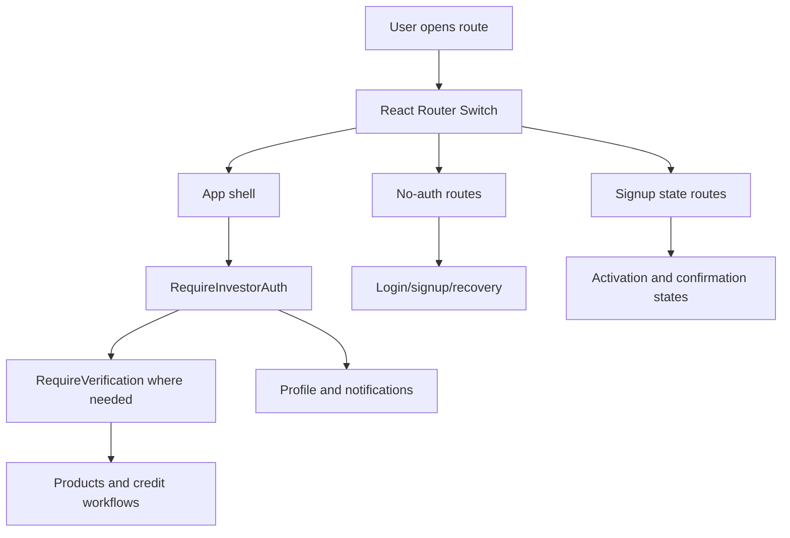
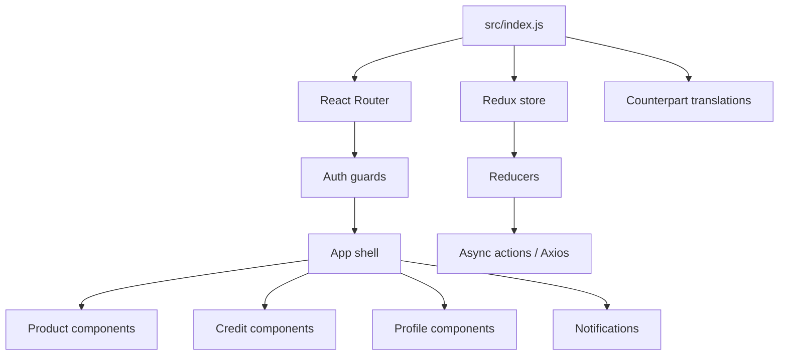

# Pihub Investor / CreditTech Frontend — Product and Engineering Case Study

> A comprehensive product, UX, architecture, and maintenance case study for the Pihub Investor / CreditTech frontend. This document is intentionally detailed so designers, engineers, reviewers, maintainers, and future AI coding agents can understand the application without wandering through legacy React files like a financial archaeologist holding a broken npm install.

## Table of Contents

1. [Executive Summary](#executive-summary)
2. [Repository Snapshot](#repository-snapshot)
3. [Product Context](#product-context)
4. [Problem Statement](#problem-statement)
5. [Primary Users](#primary-users)
6. [Application Scope](#application-scope)
7. [Core User Journeys](#core-user-journeys)
8. [Routing Model](#routing-model)
9. [Authentication and Verification Model](#authentication-and-verification-model)
10. [State Management Model](#state-management-model)
11. [Internationalization Model](#internationalization-model)
12. [Product and Credit Workflows](#product-and-credit-workflows)
13. [Profile and Notification Workflows](#profile-and-notification-workflows)
14. [Frontend Architecture](#frontend-architecture)
15. [Environment Configuration](#environment-configuration)
16. [Docker and Deployment Model](#docker-and-deployment-model)
17. [Security and Privacy Notes](#security-and-privacy-notes)
18. [Fintech UX Principles](#fintech-ux-principles)
19. [Accessibility Strategy](#accessibility-strategy)
20. [Form Design Strategy](#form-design-strategy)
21. [Error and Empty State Strategy](#error-and-empty-state-strategy)
22. [Testing and QA Strategy](#testing-and-qa-strategy)
23. [Legacy Dependency Risk](#legacy-dependency-risk)
24. [Modernization Strategy](#modernization-strategy)
25. [Risk Register](#risk-register)
26. [Maintenance Playbook](#maintenance-playbook)
27. [Release Checklist](#release-checklist)
28. [Portfolio Review Notes](#portfolio-review-notes)
29. [AI Coding Agent Notes](#ai-coding-agent-notes)
30. [Appendix A: Suggested API Contracts](#appendix-a-suggested-api-contracts)
31. [Appendix B: Suggested Permission Matrix](#appendix-b-suggested-permission-matrix)
32. [Appendix C: Manual QA Matrix](#appendix-c-manual-qa-matrix)
33. [Appendix D: Glossary](#appendix-d-glossary)
34. [Disclaimer](#disclaimer)

---

## Executive Summary

**Pihub Investor / CreditTech Frontend** is a legacy React frontend for an investor and credit-product platform. It uses Create React App, React 16, React Router 5, Redux, Redux Thunk, Redux Form, Axios, Counterpart translation support, protected route wrappers, local storage bootstrapping, and Docker deployment files.

The app supports workflows around:

- login and logout
- signup and account activation
- email confirmation
- password reset and change password
- verification-gated investor access
- product listing
- product creation and editing
- invested products
- applied products
- product applications
- credit request lists and details
- creditor details
- notifications
- profile view and edit flows
- terms and conditions
- multilingual UI in English and German

This is not a modern greenfield app. It is a business-facing legacy frontend with real route structure, financial/credit-domain workflows, and maintenance risk from older dependencies. The main value of this case study is to document what the app is, how it works, what risks must be controlled, and how it could be modernized safely.

The project should be treated as a **frontend application shell**, not as a source of truth for authentication, permissions, credit decisions, investor eligibility, financial product terms, or compliance behavior. Frontend route guards improve user experience, but backend authorization must enforce real security. Apparently we still have to write this down because frontends keep pretending a hidden button is a security boundary.

---

## Repository Snapshot

| Attribute | Value |
|---|---|
| Repository | `Nischhalsubba/Pihub-Investor` |
| Default branch | `develop` |
| App type | Investor / CreditTech frontend |
| UI framework | React `16.8.6` |
| Build system | Create React App / `react-scripts` `3.0.1` |
| Routing | React Router DOM `5.0.1` |
| State | Redux `4.0.4` |
| Async middleware | Redux Thunk `2.3.0` |
| Forms | Redux Form `8.2.5` |
| HTTP client | Axios `0.19.0` |
| i18n | Counterpart + React Translate Component |
| Deployment support | Dockerfile, Dockerfile.dev, docker-compose.yml |
| Supported locales | English and German |
| Project status | Legacy frontend requiring careful maintenance |

---

## Product Context

Credit and investment platforms handle user journeys where trust, clarity, identity, and status are more important than decoration. A user may be trying to understand whether their account is activated, whether their email is confirmed, whether they are verified, whether they can access product workflows, whether a product is available, whether a credit request is actionable, or whether a form submission succeeded.

The app is therefore not just a collection of screens. It is a stateful business interface with multiple account phases and financial-domain actions.

### What the product appears to support

The route structure and README indicate support for:

- public authentication and recovery screens
- signup activation and confirmation states
- authenticated investor dashboard area
- verification-gated workflows
- product creation and product management
- product investment/application tracking
- credit request listing and detail screens
- creditor detail view
- notifications
- profile management
- legal terms route

### Why documentation matters here

Legacy fintech frontends are risky when institutional knowledge disappears. Routes, guards, local storage, API expectations, translation files, and deployment assumptions can all become invisible traps.

A clear case study helps future maintainers answer:

- What flows exist?
- Which routes are protected?
- Which routes require verification?
- Where does auth state come from?
- What data is stored client-side?
- Which dependencies are legacy risks?
- What should backend enforce regardless of frontend behavior?
- What should be tested before deployment?

---

## Problem Statement

### User problem

Investors and platform users need to complete account, product, application, and credit-request workflows with confidence. They need to understand what they can do, what is blocked, what still needs verification, and what actions have consequences.

### Business problem

A CreditTech frontend must reduce support burden and user confusion. Poor route behavior, unclear verification states, vague errors, or broken multilingual copy can make users lose trust in the platform.

### Technical problem

The application is built on older React and Create React App dependencies. It needs stable maintenance, better documentation, dependency-risk awareness, and a careful modernization strategy.

### Security problem

Frontend route guards are useful for navigation, but they are not security enforcement. The backend must validate all authentication, authorization, role, verification, product, and credit-related operations.

### UX problem

Financial workflows punish ambiguity. A user should never wonder whether a product application was submitted, whether a credit request is editable, whether account verification is blocking a page, or whether an error is their fault.

---

## Primary Users

### 1. Investor user

An investor logs in, completes onboarding or verification requirements, browses products, reviews applications, checks credit requests, and manages profile information.

Needs:

- clear login and signup states
- reliable verification messaging
- readable product and credit data
- visible action availability
- predictable navigation
- trustworthy form feedback

### 2. Unverified user

An unverified user may be authenticated but blocked from important workflows.

Needs:

- explanation of why access is blocked
- next step for verification
- status of submitted documents or profile data
- contact or support information
- non-hostile wording, because blaming users for compliance flows is a charmingly terrible habit

### 3. Product manager / operations user

A business stakeholder wants to understand product lists, credit-request states, application flows, and user journey friction.

Needs:

- route map
- status taxonomy
- workflow documentation
- QA coverage
- error-state inventory

### 4. Frontend maintainer

A developer needs to modify flows without breaking route guards, local storage behavior, translations, or Docker deployment.

Needs:

- dependency map
- routing map
- auth/verification model
- environment setup
- build commands
- modernization plan

### 5. Designer or UX reviewer

A designer needs to review a form-heavy credit/investor experience.

Needs:

- information hierarchy notes
- form design guidance
- empty and error state rules
- accessibility checklist
- trust and compliance UX guidelines

---

## Application Scope

### Public and no-auth flows

| Area | Routes | Purpose |
|---|---|---|
| Login | `/login` | Authenticate existing users |
| Signup | `/signup` | Register new users |
| Forgot password | `/forgot-password` | Start recovery flow |
| Set password | `/set-password/:token` | Set or reset password through token |
| Terms | `/terms-and-conditions` | Display legal terms |

### Signup and activation flows

| Area | Routes | Purpose |
|---|---|---|
| Activation | `/signup/activated` | Show activation state |
| Confirm email | `/signup/confirm-email` | Guide user through email confirmation |
| Confirmation | `/signup/confirmation` | Show confirmation state |
| Approval | `/confirm/:hash` | Confirm by hash token |
| Password success | `/password-change-success` | Show password change completion |

### Authenticated flows

| Area | Routes | Purpose |
|---|---|---|
| Product list | `/`, `/products` | Main product listing |
| Add product | `/add-product` | Create product workflow |
| Edit product | `/edit-product` | Edit product workflow |
| Invested products | `/products-invested` | Products invested in by user |
| Applied products | `/products-applications` | Products user has applied to |
| View product | `/product` | Product detail view |
| Applications | `/product/applications`, `/application` | Application lists and details |
| Credit requests | `/credit-request` | Credit request list |
| Creditor detail | `/creditor/detail` | Creditor information |
| Notifications | `/notifications` | Notification list |
| Profile | `/user/profile`, `/user/edit-profile` | View/edit profile |
| Account status | `/account-unverified` | Unverified account state |
| Logout | `/logout` | Sign out |

### Verification-gated flows

The following route areas are wrapped in verification requirements:

- `/`
- `/products`
- `/add-product`
- `/edit-product`
- `/products-invested`
- `/credit-request`

The exact verification rules must be enforced by backend APIs, not only frontend guards.

---

## Core User Journeys

### Journey 1: New investor signup

1. User visits `/signup`.
2. User submits registration information.
3. User is shown activation or confirmation instructions.
4. User confirms email through `/confirm/:hash` or related confirmation routes.
5. User may land in a pending approval or verification state.
6. User gains access to authenticated product areas after status requirements are met.

Key UX requirements:

- tell the user what happened after signup
- explain email-confirmation steps clearly
- preserve form data carefully where safe
- show support path if email confirmation fails
- avoid ambiguous “pending” labels

### Journey 2: Returning investor login

1. User visits `/login`.
2. User enters credentials.
3. Auth token is stored client-side.
4. Redux auth state initializes from local storage.
5. User is routed into protected app sections.
6. Backend should validate token on API calls.

Key UX requirements:

- clear validation messages
- safe failed-login handling
- redirect authenticated users away from no-auth routes
- handle expired token gracefully
- do not expose sensitive error details

### Journey 3: Forgot password and set password

1. User visits `/forgot-password`.
2. User submits email.
3. Backend sends recovery token.
4. User opens `/set-password/:token`.
5. User sets a new password.
6. User sees success state.

Key UX requirements:

- do not reveal whether an email exists in a risky way
- validate password requirements before submission
- handle expired or invalid token
- provide safe retry path
- show completion state clearly

### Journey 4: Verification-blocked user

1. User logs in successfully.
2. User tries to access a verification-required route.
3. `RequireVerification` blocks access.
4. User is sent or shown an unverified account experience.
5. User receives next-step guidance.

Key UX requirements:

- explain the reason for blocked access
- list required documents or actions
- show verification status
- avoid confusing dead ends
- provide contact or support path

### Journey 5: Product browsing and management

1. User opens product list.
2. User reviews product cards or table rows.
3. User opens product detail.
4. User applies to, invests in, adds, or edits product depending on role/status.
5. User sees success, pending, or error state.

Key UX requirements:

- clear product status labels
- financial terms must be readable
- risk labels must be visible
- primary actions must be unambiguous
- edit and application actions must be permission-aware

### Journey 6: Credit request review

1. User opens `/credit-request`.
2. User reviews list of credit requests.
3. User opens detail screen.
4. User reviews creditor detail or related information.
5. User takes allowed action or returns to list.

Key UX requirements:

- strong table/list hierarchy
- clear amount, status, date, and party labels
- no hidden critical terms
- safe loading and error states
- backend permission enforcement

### Journey 7: Profile management

1. User opens `/user/profile`.
2. User reviews personal/profile data.
3. User opens `/user/edit-profile`.
4. User edits fields and submits.
5. App shows success or validation failure.

Key UX requirements:

- clear required fields
- safe file/image upload handling if present
- validation before submit
- confirmation after save
- avoid storing excessive personal data in browser storage

---

## Routing Model

The app uses React Router 5 with `BrowserRouter`, `Switch`, `Route`, and route guard higher-order components.

### Guard components

| Guard | Purpose |
|---|---|
| `RequireNoAuth` | Keeps authenticated users away from no-auth pages |
| `RequireInvestorAuth` | Restricts routes to authenticated investor users |
| `RequireVerification` | Restricts sensitive routes to verified users |

### Route model diagram



### Routing risks

| Risk | Why it matters | Mitigation |
|---|---|---|
| Guard mismatch | Users see wrong screen | Route matrix QA |
| Token stale in local storage | App thinks user is logged in | Backend validation and logout handling |
| Unverified access confusion | Users do not know what to do | Strong unverified screen copy |
| Route order mistakes | Wrong component renders | Explicit route tests |
| Query/state missing | Product detail cannot load | Validate required params or IDs |

---

## Authentication and Verification Model

The app bootstraps Redux auth state from:

```js
localStorage.getItem('token')
```

This means browser storage plays a major role in initial route behavior.

### Important distinction

Client-side auth state is a convenience. It is not a final security decision.

The backend must enforce:

- valid token
- token expiration
- user role
- account verification
- product permissions
- credit request permissions
- profile ownership
- file upload authorization
- action limits

### Frontend responsibilities

The frontend should:

- redirect obviously unauthenticated users
- show correct verification status
- reduce accidental access to irrelevant screens
- provide clear state transitions
- remove token on logout
- handle expired token responses from backend

### Backend responsibilities

The backend must:

- reject invalid or expired tokens
- check authorization on every protected endpoint
- validate submitted data
- enforce product and credit workflow rules
- prevent users from accessing other users’ data
- log security-relevant actions

### Token storage risk

Local storage is convenient but exposed to JavaScript. If XSS occurs, tokens in local storage are vulnerable.

Recommended review:

- evaluate whether token storage can be moved to secure HTTP-only cookies
- strengthen content security policy
- sanitize rendered content
- avoid injecting untrusted HTML
- audit dependencies for known vulnerabilities

---

## State Management Model

The app uses Redux with Redux Thunk.

### Current pattern

- reducers are combined into root reducers
- store is created in `src/index.js`
- auth state initializes from local storage
- Redux Thunk supports async action flows
- Redux Form manages form state

### Recommended state categories

| State category | Examples |
|---|---|
| Auth state | token, authenticated flag, user role, verification status |
| Product state | product list, product detail, add/edit status |
| Application state | application list and detail data |
| Credit state | credit requests, creditor detail |
| Notification state | unread/read notification lists |
| Profile state | profile view/edit data |
| UI state | loading, errors, modal states, language |

### State design guidance

- Keep server-sourced financial data fresh.
- Avoid trusting stale cached state for critical decisions.
- Clear sensitive state on logout.
- Keep loading and error state per workflow, not as one global shrug.
- Normalize repeated entities where the app grows.

---

## Internationalization Model

The app uses Counterpart with English and German locale files.

Locale selection follows:

1. stored language in local storage
2. browser language fallback
3. default fallback behavior

### i18n risks

| Risk | Why it matters |
|---|---|
| Hardcoded labels | Users see mixed languages |
| Long German strings | Layout can break |
| Missing translations | Critical flows become confusing |
| Financial terms mistranslated | Trust and legal risk |
| Error messages untranslated | Users cannot recover |

### Translation guidance

- Keep financial terminology consistent.
- Avoid translating legal or product terms casually.
- Test all auth and verification flows in each locale.
- Review button lengths in German.
- Avoid concatenating translated fragments.
- Use full sentence strings for messages.

### Translation QA

Check:

- login
- signup
- forgot password
- set password
- verification blocked screen
- product list
- product forms
- credit requests
- notifications
- profile edit
- terms and conditions

---

## Product and Credit Workflows

### Product workflow model

Product areas include list, add, edit, view, invested products, applied products, and product applications.

Potential product fields:

- product name
- product type
- investment amount
- expected return
- duration
- risk category
- status
- borrower/creditor relation
- application status
- created/updated dates
- documents or supporting information

### Credit request model

Credit request screens likely involve:

- requested amount
- borrower/creditor details
- status
- application date
- supporting documents
- approval state
- repayment or duration terms
- notes or messages

### Product UX rules

1. Status must be visible.
2. Financial numbers must be formatted consistently.
3. Critical terms must not be hidden under tooltips only.
4. Actions should explain consequences.
5. Empty states should tell the user what to do next.
6. Loading states should not look like missing data.
7. Error messages should be actionable.

### Credit workflow caution

Any financial or credit-related frontend must avoid suggesting approval, eligibility, return, risk, or product status unless the backend response and business rules support it. The UI should not invent optimism. Humanity already has marketing departments for that.

---

## Profile and Notification Workflows

### Profile workflows

The app includes:

- profile view
- edit profile
- change password
- password change success

Profile data may include personally identifiable information. Treat it carefully.

Recommended behavior:

- validate inputs before submit
- show server-side errors clearly
- avoid exposing sensitive details in client logs
- clear stale state after logout
- confirm successful updates
- handle failed save without data loss

### Notification workflows

The app includes a notification list route.

Recommended notification fields:

- title
- message
- read/unread state
- category
- created date
- related product or credit request
- action URL where applicable

Notification UX should distinguish between:

- informational messages
- required actions
- verification updates
- product/application updates
- credit request updates
- system/security messages

---

## Frontend Architecture

### Entry point

`src/index.js` sets up:

- React root render
- Redux provider
- store creation
- Redux Thunk middleware
- Counterpart translations
- BrowserRouter
- route definitions
- auth/verification guards

### Suggested architecture map



### Folder responsibilities

| Path | Purpose |
|---|---|
| `src/index.js` | App bootstrap, store, routing, locale setup |
| `src/_locale/` | English and German translation files |
| `src/components/App` | Authenticated application shell |
| `src/components/_auth/` | Route guard components |
| `src/components/user/` | Login, signup, profile, password flows |
| `src/components/products/` | Product list, add, edit, view, application flows |
| `src/components/credits/` | Credit request and creditor detail views |
| `src/components/notifications/` | Notification list |
| `src/components/general/` | General pages and fallback states |
| `src/reducers/` | Redux reducers |
| `Dockerfile` | Production container build |
| `Dockerfile.dev` | Development container build |
| `docker-compose.yml` | Runtime service definition |

---

## Environment Configuration

Create React App exposes only variables prefixed with `REACT_APP_`.

The Docker Compose file references:

```text
REACT_APP_API_URL
```

### Environment rules

- Do not commit real secrets.
- Frontend environment variables are not secrets if exposed to the browser.
- Use `.env.local` for local-only config.
- Keep `.dist-env` as a safe template.
- Backend base URLs must match deployment environment.
- Test auth flows against the correct backend environment.

### Environment priority

Development:

```text
.env.development.local
.env.development
.env.local
.env
```

Production:

```text
.env.production.local
.env.production
.env.local
.env
```

Test:

```text
.env.test.local
.env.test
.env
```

---

## Docker and Deployment Model

The repository includes development and production Docker configurations.

### Production Dockerfile

The production Dockerfile:

1. uses `node:alpine`
2. copies `package.json`
3. runs `npm install`
4. copies app files
5. runs `npm run build`
6. installs `serve`
7. serves the CRA build on port 5000

### Development Dockerfile

The development Dockerfile:

1. uses `node:alpine`
2. copies `package.json`
3. runs `npm install`
4. copies app files
5. runs `npm run start`

### Docker Compose

The Compose service:

- builds the frontend
- restarts always
- maps `5000:5000`
- passes `REACT_APP_API_URL`
- uses an external `credittech` network
- includes Traefik labels for historical deployment hosts

### Deployment risks

| Risk | Why it matters | Mitigation |
|---|---|---|
| Node Alpine latest drift | Builds can change over time | Pin Node major version |
| `npm install` not deterministic | Dependency drift | Use lockfile and `npm ci` where possible |
| Old CRA dependencies | Build/runtime warnings | Modernize or lock environment |
| Traefik host labels stale | Misrouting | Review deployment domains |
| Frontend-only auth | False security | Backend authorization required |

---

## Security and Privacy Notes

### Security boundary

The frontend must not be treated as the security boundary.

Frontend route guards:

- improve user experience
- prevent accidental navigation
- simplify page access logic

They do not:

- protect backend resources
- prevent API calls from modified clients
- validate business rules
- enforce investor eligibility
- secure financial product access

### Sensitive areas

- auth token storage
- profile data
- product applications
- credit requests
- creditor details
- uploaded documents
- notifications
- password reset tokens
- verification status

### Recommendations

1. Consider HTTP-only secure cookies instead of local storage tokens.
2. Validate every protected action on the backend.
3. Avoid storing sensitive profile or credit data in local storage.
4. Sanitize all rendered content.
5. Review Axios interceptors and token handling.
6. Do not expose internal API errors directly to users.
7. Add CSP headers at deployment layer.
8. Run dependency vulnerability audits before production use.

### Password flows

Password reset and set-password routes must treat tokens carefully.

Recommended behavior:

- expire tokens quickly
- never log reset tokens
- never display reset tokens in UI
- validate password rules client-side and server-side
- show generic error messages where account enumeration risk exists

---

## Fintech UX Principles

Fintech and credit interfaces need more restraint than most products.

### Principle 1: Clarity beats persuasion

Users should understand what they are doing. Avoid copy that over-promises returns, approval, risk reduction, or platform guarantees.

### Principle 2: Status must be visible

Every product, application, credit request, profile update, and verification state should have a visible status.

### Principle 3: Forms must reduce mistakes

A financial form should not punish users with vague errors after submit. Validate early, label clearly, and preserve safe entered data after failed submission.

### Principle 4: Trust signals must be earned

Badges and polished UI are not enough. Show clear data, terms, and next steps.

### Principle 5: Risk language must be honest

If investment or credit risk is relevant, do not bury it. The interface should not present uncertain outcomes as guaranteed results. That path leads straight to regulatory sadness and support tickets, the two horsemen of fintech despair.

---

## Accessibility Strategy

### Priority areas

- login forms
- signup forms
- password reset forms
- product forms
- credit request tables
- profile edit forms
- verification blocked screen
- notifications
- language switcher if present

### Accessibility rules

- Every input needs a clear label.
- Error messages should be programmatically associated with fields.
- Required fields should be explicit.
- Keyboard navigation must work through forms and tables.
- Buttons and links must be distinguishable.
- Color must not be the only status indicator.
- Focus state must be visible.
- German text expansion must not break layout.
- Loading and error states must be announced where appropriate.

### Table accessibility

Financial and credit-related tables should use:

- clear column headers
- consistent numeric alignment
- readable date and currency formatting
- row actions with accessible labels
- status text, not only colored badges

---

## Form Design Strategy

This app is form-heavy. Forms are where fintech trust either survives or walks into the sea.

### Form rules

1. Group related fields.
2. Use descriptive labels.
3. Provide helper text where the field is ambiguous.
4. Validate before submit where possible.
5. Show server errors near the relevant field or action.
6. Preserve safe user input after errors.
7. Disable submit only when the reason is clear.
8. Confirm success explicitly.
9. Avoid giant forms without sectioning.
10. Do not hide legal or risk terms behind unclear links.

### High-risk form areas

- signup
- password reset
- product add/edit
- product applications
- credit requests
- profile edit
- document uploads if present

### File upload caution

If product, credit, or profile workflows accept uploaded files, the backend must validate type, size, content, ownership, and virus/malware risk. The frontend should show allowed formats and size limits clearly.

---

## Error and Empty State Strategy

### Error state types

| Error type | Example | UX response |
|---|---|---|
| Auth error | Invalid token | Redirect or ask user to log in again |
| Verification error | Account not verified | Explain next step |
| Permission error | Cannot view product/application | Explain access limit safely |
| Validation error | Missing field | Highlight field and explain requirement |
| Network error | API unavailable | Retry guidance |
| Server error | Unexpected failure | Generic safe message and support path |
| Empty list | No products/applications | Explain what happens next |

### Empty state examples

- No products available
- No invested products yet
- No applications submitted
- No credit requests found
- No notifications
- Profile information incomplete
- Account not verified

Each empty state should answer:

1. What is missing?
2. Why might it be missing?
3. What can the user do next?

“Nothing here” is not an empty state. It is a shrug rendered in HTML.

---

## Testing and QA Strategy

### Command-level checks

```bash
npm install
npm start
npm run test
npm run build
```

For Docker:

```bash
docker build -f Dockerfile.dev .
docker build . -t pihub-investor-frontend
docker-compose up
```

### Functional QA

Test:

- login
- logout
- signup
- activation
- email confirmation
- forgot password
- set password
- change password
- verified route access
- unverified route blocking
- product list
- add product
- edit product
- view product
- invested products
- applied products
- product applications
- credit request list
- credit request detail
- creditor detail
- notifications
- profile view
- profile edit
- terms page

### Security QA

Test:

- expired token behavior
- missing token behavior
- invalid token behavior
- manual navigation to protected routes
- manual navigation to verification-required routes
- backend rejects unauthorized API calls
- logout clears sensitive state
- reset token is not logged
- environment variables expose no secrets

### i18n QA

Test all major flows in:

- English
- German

Check for:

- missing translation keys
- truncated text
- overflow
- mixed-language screens
- legal/financial term consistency

---

## Legacy Dependency Risk

The project uses older dependencies.

### Key risks

| Dependency area | Risk |
|---|---|
| React 16.8 | Old runtime, hook-era but not modern React |
| CRA 3 | Deprecated ecosystem assumptions |
| Axios 0.19 | Very old HTTP client version |
| Moment | Heavy and legacy date library |
| Redux Form | No longer the preferred form approach |
| React Router 5 | Legacy routing model |
| Node Alpine latest | Build environment drift |

### Why this matters

Legacy dependencies can still work, but they increase maintenance cost. Security advisories, peer dependency drift, old build assumptions, and ecosystem deprecation all accumulate. Software does not age like wine. It ages like milk in a warm server room.

### Short-term mitigation

- preserve lockfile if available
- pin Node image versions
- avoid unnecessary dependency churn
- audit vulnerabilities before deployment
- update only with regression testing

### Long-term mitigation

- migrate CRA to Vite or modern framework
- move React Router 5 to Router 6+
- replace Redux Form with React Hook Form or controlled form strategy
- update Axios
- replace Moment where feasible
- review auth token storage
- add modern testing stack

---

## Modernization Strategy

Modernization should be phased. Do not rewrite everything at once unless the goal is to convert technical debt into a bonfire.

### Phase 1: Stabilize

- document current routes
- document API contracts
- freeze supported Node version
- add QA checklist
- audit dependencies
- add basic smoke tests
- confirm Docker build behavior

### Phase 2: Improve safety

- review token handling
- add centralized Axios interceptors if missing
- improve expired-token behavior
- improve route guard tests
- improve error handling
- add form validation documentation

### Phase 3: Improve UX

- review verification flow
- improve empty states
- improve product and credit status labels
- improve multilingual layout
- improve accessibility of forms and tables

### Phase 4: Technical upgrade

- migrate from CRA to Vite
- upgrade React
- migrate routing
- replace legacy form library
- update date and HTTP libraries
- add modern test coverage

### Phase 5: Product hardening

- add role/permission matrix
- add audit-friendly UI states
- add user-facing status history
- add safer document upload UX
- add product/credit workflow analytics if legally and ethically appropriate

---

## Risk Register

| Risk | Severity | Why it matters | Mitigation |
|---|---:|---|---|
| Frontend guards mistaken for security | High | Users can bypass frontend | Backend authorization on every endpoint |
| Token in local storage | High | XSS can expose token | Consider HTTP-only cookies, CSP, sanitization |
| Old dependencies | High | Security and maintenance risk | Audit and phased modernization |
| Unclear verification state | High | Users blocked without guidance | Better verification UX |
| Financial terms unclear | High | Trust and compliance risk | Clear labels, risk copy, legal review |
| Missing translations | Medium | Broken multilingual experience | Translation QA |
| Docker image drift | Medium | Builds may break later | Pin Node image, use lockfile |
| Stale environment values | Medium | App points to wrong backend | Environment documentation and release checks |
| Form validation gaps | High | Bad submissions or user confusion | Client/server validation |
| Backend error leakage | Medium | Security/privacy issue | Safe error mapping |
| Profile data exposure | High | PII risk | Minimize storage and logging |
| Product workflow ambiguity | High | User may misunderstand action | Clear confirmation and status messages |

---

## Maintenance Playbook

### Updating a route

1. Update route definition in `src/index.js` or related route module.
2. Confirm correct guard wrapper.
3. Update README route table if meaningful.
4. Test authenticated, unauthenticated, verified, and unverified states.
5. Test direct browser navigation.
6. Test language output.

### Updating a form

1. Identify Redux Form integration.
2. Review validation rules.
3. Review server error mapping.
4. Confirm required fields.
5. Test empty submission.
6. Test invalid submission.
7. Test successful submission.
8. Test both locales.
9. Test mobile layout.

### Updating an API integration

1. Confirm endpoint and method.
2. Confirm auth requirements.
3. Confirm backend permission behavior.
4. Add loading state.
5. Add empty state.
6. Add safe error state.
7. Avoid logging sensitive payloads.
8. Test expired token response.

### Updating Docker deployment

1. Confirm environment variables.
2. Confirm exposed port.
3. Confirm backend URL.
4. Build development image.
5. Build production image.
6. Run container locally.
7. Check routing refresh behavior.
8. Confirm no secrets are baked into image.

---

## Release Checklist

```bash
npm install
npm run test
npm run build
```

Docker:

```bash
docker build -f Dockerfile.dev .
docker build . -t pihub-investor-frontend
docker-compose up
```

Manual verification:

- [ ] login works
- [ ] logout works
- [ ] signup works
- [ ] signup activation route works
- [ ] confirmation routes work
- [ ] forgot password works
- [ ] set password token route works
- [ ] change password works
- [ ] protected routes redirect unauthenticated users
- [ ] no-auth routes redirect authenticated users
- [ ] verification-required routes block unverified users
- [ ] unverified page explains next steps
- [ ] product list loads
- [ ] add product flow works
- [ ] edit product flow works
- [ ] product detail works
- [ ] invested product list works
- [ ] applied product list works
- [ ] product applications work
- [ ] credit request list works
- [ ] credit request detail works
- [ ] creditor detail works
- [ ] notification list works
- [ ] profile view works
- [ ] profile edit works
- [ ] terms page works
- [ ] English locale works
- [ ] German locale works
- [ ] mobile layout is usable
- [ ] no real secrets are committed
- [ ] backend rejects unauthorized API calls

---

## Portfolio Review Notes

This repository is useful as a portfolio/reference project because it demonstrates work on a real business-style application rather than a static landing page.

Strong angles:

- authenticated application flows
- route guards and verification gates
- fintech/credit UX considerations
- Redux state management
- multilingual interface support
- Docker deployment awareness
- form-heavy product complexity
- legacy modernization planning

### How to describe it

> A legacy React frontend for a CreditTech/Pihub investor platform, supporting authentication, signup activation, verification-gated investor routes, product workflows, credit request screens, notifications, profile management, Redux state, multilingual UI, and Docker deployment. The project demonstrates business application structure, financial-domain UX constraints, and maintenance planning for older React/CRA stacks.

### What not to overclaim

Do not claim:

- backend security is implemented in this frontend
- investment/credit decisions are made here
- product data is complete without backend context
- this is a modern React architecture
- route guards alone secure data
- financial workflows are production-compliant without backend and legal review

A good portfolio tells the truth better than the code comments did. Revolutionary, apparently.

---

## AI Coding Agent Notes

Future AI agents should not treat this app like a modern React project.

### Inspect first

Before making changes, inspect:

1. `README.md`
2. `package.json`
3. `.dist-env`
4. `src/index.js`
5. `src/components/_auth/`
6. `src/reducers/`
7. `src/_locale/`
8. product components
9. credit components
10. Docker files

### Preserve route guards

When editing routes, keep auth and verification wrappers intentional.

Do not casually remove:

- `RequireInvestorAuth`
- `RequireNoAuth`
- `RequireVerification`

### Preserve translations

When adding UI text, update locale files instead of hardcoding strings into components.

### Be careful with auth

Do not move more sensitive state into local storage. Do not expose tokens in logs. Do not add frontend-only “security” checks and pretend they are enough.

### Make small changes

Legacy apps reward small changes and punish heroic rewrites. The codebase is older, so dependency upgrades should be isolated and tested.

---

## Appendix A: Suggested API Contracts

These are suggested documentation shapes. They should be aligned with the actual backend before being treated as official contracts.

### Auth response

```ts
type AuthResponse = {
  token: string;
  user: {
    id: string;
    email: string;
    role: "investor" | "admin" | "unknown";
    verified: boolean;
    emailConfirmed: boolean;
  };
};
```

### Product summary

```ts
type ProductSummary = {
  id: string;
  title: string;
  status: "draft" | "active" | "closed" | "pending" | "rejected";
  amount?: number;
  currency?: string;
  term?: string;
  riskLabel?: string;
  createdAt?: string;
  updatedAt?: string;
};
```

### Credit request summary

```ts
type CreditRequestSummary = {
  id: string;
  borrowerName?: string;
  requestedAmount?: number;
  currency?: string;
  status: "pending" | "approved" | "rejected" | "in_review" | "closed";
  submittedAt?: string;
  updatedAt?: string;
};
```

### Profile summary

```ts
type InvestorProfile = {
  id: string;
  fullName: string;
  email: string;
  phone?: string;
  verificationStatus: "unverified" | "pending" | "verified" | "rejected";
  language?: "en" | "de";
};
```

---

## Appendix B: Suggested Permission Matrix

| Feature | Not logged in | Logged in unverified | Logged in verified | Backend enforcement required |
|---|---:|---:|---:|---:|
| Login | Yes | No | No | Yes |
| Signup | Yes | No | No | Yes |
| Forgot password | Yes | Yes | Yes | Yes |
| Product list | No | Limited/blocked | Yes | Yes |
| Add product | No | No | Yes | Yes |
| Edit product | No | No | Yes if allowed | Yes |
| View product | No | Possibly limited | Yes | Yes |
| Product applications | No | Possibly limited | Yes | Yes |
| Credit requests | No | No | Yes | Yes |
| Creditor detail | No | Possibly limited | Yes if allowed | Yes |
| Notifications | No | Yes | Yes | Yes |
| Profile | No | Yes | Yes | Yes |
| Edit profile | No | Yes | Yes | Yes |
| Terms | Yes | Yes | Yes | No sensitive data |

---

## Appendix C: Manual QA Matrix

| Area | Scenario | Expected result |
|---|---|---|
| Auth | Visit `/login` while logged out | Login page appears |
| Auth | Visit `/login` while logged in | User redirects away from login |
| Auth | Invalid login | Safe error appears |
| Auth | Logout | Token and auth state clear |
| Password | Forgot password valid email | Confirmation appears |
| Password | Invalid reset token | Safe token error appears |
| Signup | New signup | Activation/confirmation flow appears |
| Signup | Confirm hash route | Approval flow handles hash |
| Verification | Unverified user opens `/products` | Blocked with next-step guidance |
| Product | Verified user opens product list | Products load or empty state appears |
| Product | Add product submit invalid form | Field errors appear |
| Product | Edit product without data | Helpful error/loading state appears |
| Application | Application detail loads | Correct data scope appears |
| Credit | Credit request list empty | Empty state explains next step |
| Credit | Credit request detail unavailable | Safe error appears |
| Profile | View profile | User data displays safely |
| Profile | Edit profile invalid fields | Field-level validation appears |
| Notifications | No notifications | Helpful empty state appears |
| i18n | Switch/use German | Layout handles longer strings |
| i18n | Missing key | Missing translation is caught |
| Docker | Production container runs | App served on port 5000 |
| Security | Manual API call without auth | Backend rejects request |
| Security | Expired token | User is logged out or asked to re-authenticate |

---

## Appendix D: Glossary

| Term | Meaning |
|---|---|
| Investor | User interacting with product and credit workflows |
| CreditTech | Credit-focused technology platform category |
| Product | Financial or credit product surfaced in the app |
| Credit request | Request or record related to credit workflow |
| Verification | Account status gate before sensitive workflows |
| Route guard | Frontend wrapper controlling route access UX |
| Redux | Global state management library |
| Redux Thunk | Middleware for async Redux actions |
| Redux Form | Legacy form state library |
| CRA | Create React App build system |
| Counterpart | Translation/i18n library used in this app |
| `REACT_APP_` | Prefix required for CRA-exposed frontend environment variables |
| Local storage token | Browser-stored auth token used to initialize frontend auth state |
| Docker Compose | Container orchestration file used by the repository |
| Traefik | Reverse proxy referenced in historical compose labels |

---

## Disclaimer

This repository is a frontend application and documentation artifact. It must not be treated as the source of truth for credit eligibility, investor verification, financial product terms, legal compliance, authentication security, authorization, or backend business rules.

All important financial, identity, permission, product, application, and credit-request actions must be validated and enforced by backend systems. This documentation is intended to support product understanding, maintenance, UX review, and safe modernization. It is not financial, legal, regulatory, or investment advice.
